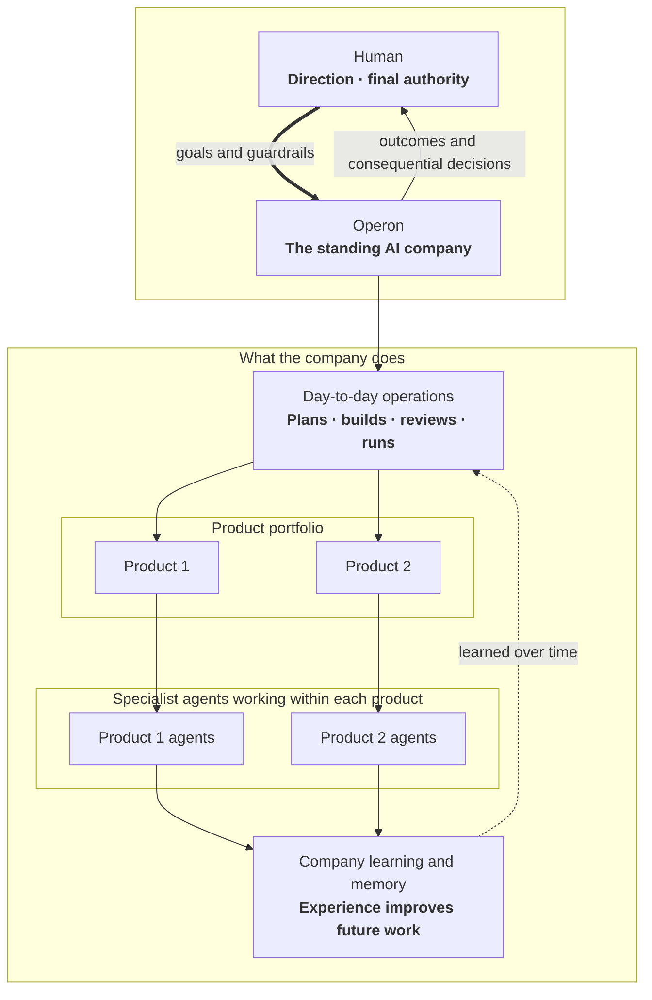

# Operon Architecture

*v1.8 — last aligned 2026-07-27. This is the implementation map: how Operon
actually runs, and where each subsystem's full contract lives. Decisions and
their history belong to `docs/PURPOSE.md` → Decided; numeric budgets, routes,
and measurement definitions live only in `docs/episodes/contract.md`;
qualification and release gating in `docs/qualification/design.md`. Propose
implementation changes here first, and promote them to PURPOSE only after
human ratification.*

## 0. Overview

Operon is an installable **org runtime**: a standing AI company that develops
and operates a portfolio of independent software products. One human leads by
setting goals and guardrails and by making the critical decisions. Operon
handles the day-to-day work that turns that direction into software outcomes.



Read the diagram as an organization, not as an implementation architecture.
The human runs the company rather than its task queue. Each product stays
independent; shared learning must not erase product boundaries.

The runtime execution path:

```
launchd (now) / systemd timer (droplet later)
      │  fires every ~5 min
      ▼
operon dispatch  ── reads ──►  roles.yaml · apps.yaml · schedule state · events
      │
      │  for each due episode: acquire lock, gather deterministic facts
      ▼
EpisodePlanner boundary (src/org/episode-planner)
      │  complete creator scope ─► normalize (zero provider turns)
      │  otherwise ──────────────► fixed boot assignment + bounded planner
      ▼
validated, durable EpisodePlan (src/loop)
      │  ready provider/mechanical/approval steps in DAG order
      ▼
turn runner / pass transport
      │  role permissions ∩ selected adapter capabilities
      ▼
runtime adapter (claude | codex | pi)          src/runtime
      │  every tool action → GateFn ── critical ops denied + escalated
      ▼
artifacts land on GitHub (issues, PRs, comments, merges)
escalations land in the CLI approval queue ── §4
telemetry / memory / scorecard events written at turn end ── §6
```

**There is no planning intelligence in the tick.** Every ~5 minutes the
dispatcher wakes, works out which (role, app) pairs are due, starts a detached
process for each, and exits. "Due" is arithmetic: a role's schedule in
roles.yaml says it is time (apps.yaml may override the cadence per app), or an
event the role subscribes to has arrived from GitHub or the local event inbox.
A turn keeps running after the tick that started it ends; the next tick sees
its fresh lock heartbeat and leaves it alone, while other due work starts in
parallel up to the org-wide WIP limit (§2).

Before any model is called, every due episode gets a plan. The dispatcher
gathers the deterministic facts into a bounded `EpisodeIntent`; the plan is
then either normalized token-free from a complete creator-supplied scope, or
designed by the EpisodePlanner in one bounded turn. Either way the result is
a schema-validated, durable `EpisodePlan` that owns the step DAG and the
exact harness/model/effort assignment of every provider step. The numeric
ceilings and identity definitions behind all of this live in
`docs/episodes/contract.md`; qualification semantics in
`docs/qualification/design.md`. Code-wise, the intent/plan/journal/settlement
modules sit on a one-way import path (`src/org` → `src/loop` →
`src/runtime`), and the observe/report surfaces are read-only leaves.

Newer work never assumes older work finished:

1. **State derives from artifacts, not intentions** (§3): a ticket is
   reviewable only when its PR exists; a PR ships only when an APPROVE review
   and green gates exist.
2. **Dependencies gate readiness** (`docs/loop/design.md` §8): `Depends-on: #N`
   becomes due only when #N is *merged*; overlapping file scopes never run
   concurrently.

| Component | Module | Notes |
| --- | --- | --- |
| Dispatcher, schedule, events, locks, trigger routing | `src/org/dispatch.ts`, `src/org/trigger-routing.ts` | roles.yaml triggers → protocols |
| App registry (`apps.yaml`) | `src/org/apps.ts` | multi-app registry |
| Authority charter + resolver | `src/org/authority.ts` | versioned org grant, app-only narrowing |
| Context assembler | `src/org/context.ts` | authority + TASTE + memory |
| Approval queue + grants | `src/org/approvals.ts` | CLI queue; approve ≠ execute |
| OKF memory / scorecards / retro | `src/org/memory.ts`, `scorecards.ts`, `retro.ts` | §6 |
| Ticket state machine | `src/loop/loop.ts` | full design in `docs/loop/design.md` |
| EpisodePlanner boundary | `src/org/episode-planner/` | intent, creator scope, planner orchestration |
| EpisodePlan + route projection | `src/loop/episode-plan.ts`, `episode-plan-executor.ts`, `episode-route.ts` | one workflow source of truth |
| Pass transport, briefs, gates, verdicts | `src/loop/pipeline.ts`, `brief.ts`, `qgates.ts`, `verdicts.ts` | `docs/loop/design.md` |
| Protocol templates | `prompts/`, `pipelines.yaml` (org home) | human-ratified; not a workflow planner |
| Runtime contract, gate, telemetry, adapters | `src/runtime/` | atomic harness/model/effort per provider turn |
| Run status + anomalies | `src/runtime/runlog/status.ts`, `anomalies.ts` | L1/L2 readers |
| Live UI / reports / narrative | `src/observe/`, `src/report/`, `src/narrative/` | presentation-only leaves |
| Governed learning | `src/org/learning/` | `docs/learning-loop/` |
| Release handoff | `src/org/release.ts` | approved deploy executed once by later dispatch |
| Package/org/state boundary | `src/org/home.ts` | org init, active pointer, state-home resolution |

A few terms recur throughout (normative definitions:
`docs/episodes/contract.md`). A **role invocation** is one wake-up of a role,
whether scheduled, event-driven, or manual. Within it, a **pass** is one
configured protocol stage — build, review, fix. A **provider turn** is one
actual call into a model adapter, and it settles into the cost ledger exactly
once. An **execution step** is one terminal record in an episode's plan;
a **mechanical step** is the deterministic kind that never constructs an
adapter and never spends tokens.

Three cross-cutting rules: every planned provider step carries one
indivisible `TurnAssignment` `{harness, model, effort}` and nothing may
silently substitute a member; the runtime gate is a pure `GateFn`, with the
org composing grants (§4) and passing them down; and adapters run headless
with a non-interactive environment overlay and dependency builds denied by
default (`PNPM_CONFIG_IGNORE_SCRIPTS`) — a ticket that needs builds opts in
via `setup_command`.

## 1. On-disk layout

Four explicit paths, one rule: **durable, curated artifacts live in git;
high-churn operational state stays outside git.** No command infers an org
home from the current working directory.

### Package root (installed Operon implementation)

```
src/operon.cjs           packaged pre-ESM cwd guard (`operon` bin)
src/operon-local.cjs     source-backed pre-ESM cwd guard
dist/                    compiled package CLI behind the preflight
src/**/*.ts              TypeScript source in a development checkout
TASTE.md                 org-init template, not an active org instance
roles.yaml               org-init template
pipelines.yaml           org-init template
prompts/                 org-init protocol templates
taste/                   org-init role craft templates
agent-skills/operon/     packaged coding-agent operating guide
```

`pnpm link:local` creates a source-backed pre-ESM launcher, so a development
checkout's next `operon` invocation reads the latest TypeScript source. Packed
installs use the parallel `src/operon.cjs` launcher before loading
`dist/cli.js`. Both absolute CommonJS entries check `process.cwd()` before any
ESM import, reject a removed caller directory with one actionable line, and
resolve templates relative to the installed package rather than the caller's
current directory.

### Org home (required, committed separately)

```
TASTE.md                 org constitution (human-ratified)
AUTHORITY.md             canonical, versioned human authority grant
AGENTS.md                Codex instructions composed around AUTHORITY.md
CLAUDE.md                Claude Code instructions composed around AUTHORITY.md
roles.yaml               org chart (human-ratified)
apps.yaml                app registry (§7)
pipelines.yaml           executable build/role protocols
prompts/                 pass templates referenced by pipelines.yaml
taste/<role>.md          role craft addenda
memory/roles/<role>/     per-role craft bundles, cross-app (§6)
skills/                  promoted skills (Agent Skills standard)
retro/<date>.md          weekly retro notes (§6)
```

`operon org init <path> --name <name>` creates a complete org home from the
packaged templates. With `--dry-run` it is a read-only preflight that prints
exactly what execution would do — the resolved org/state/pointer paths, every
file it would generate, the authority summary, and the packaged role chart —
and writes nothing. Execution stages an absent target atomically (build,
validate, rename into place); an existing real directory is populated with
exclusive file creation and exact rollback, leaving unrelated files
untouched. Any collision — a generated path that already exists, a nested
org, a non-directory, a symlink — fails before anything is mutated, and a
directory that already holds a complete org just points the operator at
`operon org use <path>`. Success creates the state home and records the
active org in `~/.operon/config`.

Onboarding also picks an authority profile: `delegated-operator` (the
default), `conservative`, or an attributable custom file — previewing which
actions will run automatically and which will wait for a human. An older org
with no `AUTHORITY.md` fails closed to the built-in legacy-conservative
profile; it never silently inherits the newer delegated default.
`OPERON_ORG_HOME` overrides the active pointer for a single process.

`operon org upgrade` migrates a legacy org, spending no tokens. By default it
only prints a byte-stable plan of the schema changes it would make. Execution
copies only the packaged surfaces that are missing (including nested
prompt/taste files newly introduced inside an existing tree), adds the
registry schema marker without rewriting app entries, writes a checksummed
archive outside the state home, and validates the whole org plus its
effective authority afterward. Ratified surfaces that already exist are never
replaced, and a legacy org with no charter must choose an authority profile
explicitly. A deterministic staging step plus a dead-process-aware lock make
an interrupted migration safe to rerun; a thrown failure restores the exact
archived bytes.

### App reset, verify, and promote

Token-free lifecycle commands for repeatable onboarding and readiness —
[`docs/org/onboarding.md`](org/onboarding.md).

### App repo (target product repo)

```
.operon/
  TASTE.md               app charter ("what this product is; what good means")
  AUTHORITY.md           session-readable org snapshot + app-only narrowing
  LABELS.md              generated canonical GitHub label reference
  config.yaml            app-entry registry mirror + top-level checkout gates
  policy.yaml            app-owned quality-gate policy emitted by bootstrap
  memory/<role>/         per-(role, app) domain bundles
  onboarding-report.md   deterministic setup/documentation inventory
  bootstrap/             initial issue and operator next steps for new apps
AGENTS.md                existing content + one marked Operon authority block
CLAUDE.md                existing content + one marked Operon authority block
```

**Containment invariant.** Operon's owned app artifacts live under `.operon/`,
with one deliberately narrow exception: onboarding composes an idempotent,
marked authority pointer into root `AGENTS.md` and `CLAUDE.md` so Codex and
Claude Code see the charter when launched directly. Existing content outside
that marker is preserved byte-for-byte. The remaining transient surface is
GitHub (`op/*` branches,
`op:*` labels) that closes out as work merges. Nothing Operon-specific is
scattered through the app's source tree, so contributors who don't run
Operon can ignore exactly one directory — the same social contract as
`.github/` or `.vscode/`. Under that invariant the directory is safe to
keep in the app repo regardless of whether the Operon tool itself is ever
open-sourced or stays private: it holds app-owned configuration and memory
(which a reader may freely see — it documents how the app is managed),
never tool source. If Operon is published, the `.operon/config.yaml` schema
becomes a public contract, so it carries a `schema_version` field from day one.

### Runtime state (`~/.operon/<org>/`, outside git entirely)

```
repos/<app>/             org-managed clone per app (worktree source, §3)
worktrees/<app>/<branch>/
state/schedule.json      last-fired per (role, app, trigger)
state/events/            consumed-event keys (dedup) + file-drop event inbox
state/turns/<turnId>.json  turn journals (§3)
state/budget-overlay.json  dispatcher budget-pause overlay (§7)
scheduler/installation.json  org-scoped scheduler ownership/definition record
scheduler/evidence/      versioned invocation, route-decision, and alert JSON
standing-roles/<app>/    grounded drafts + lifecycle-bound Planner feeds/consumption receipts
locks/<app>--<role>.lock
approvals/               pending/ decided/ grants/ log.jsonl (§4)
sessions/                adapter session artifacts where the SDK needs a home
tasks/<taskId>/           parent delegated-task record + exact operator prompt;
                         child runs correlate via parent_task_id
runs/<app>/<runId>/      L1–L3 per-pass runlogs: envelope, events, brief,
                         exact prompt, output, activity log (not a full
                         transcript; docs/loop/design.md §9)
telemetry/<day>.jsonl    org cost ledger (src/runtime/telemetry.ts orgDir)
invocations/<day>.jsonl  one terminal row per CLI command plus distinct
                         internal release-execution rows
state/invocation-journal/ pre-command intent and idempotent append recovery
tickets/<app>/<issue>.json  cross-process ticket claim state (docs/loop/design.md §7.1)
scorecards/<app>/<role>.jsonl  raw scorecard events (§6)
learning/**              learning-loop capture/episode/activation state;
                         metrics/capture-cursor.json binds eligible runs to
                         exact event ids, metrics/efficiency-health.json is a
                         refresh-only rebuildable projection, and events/,
                         episodes/, canary/, resolved/, and m6-runs/ retain
                         their governed meanings (docs/learning-loop/)
```

The org id `<org>` comes from org-home config. `OPERON_STATE_HOME` overrides
this location explicitly and independently of `OPERON_ORG_HOME`. Note
`~/.operon` is not TCC-protected on macOS, unlike `~/Documents` — launchd jobs
can read it freely (same reasoning that keeps repos at `~/Build`).

### Read-only Live UI (`operon observe`)

`src/observe/` is a presentation-only leaf over durable state and bounded
GitHub reads: loopback-only bind, per-process capability, no workflow mutation.
Stopping it never affects a run. `docs/live-ui/design.md` is the contract.
Reports and narrative are sibling presentation leaves (`docs/reporting/design.md`,
`docs/narrative/design.md`).

## 2. Dispatcher & scheduler

Operon has no daemon. The "scheduler" is the operating system's own timer —
launchd on macOS today, a systemd user timer later on a server — firing the
ordinary `operon dispatch` command every ~5 minutes. Each tick is a fresh,
stateless process: it reads configuration and durable state, decides what is
due, spawns one detached turn per due (role, app), and exits.

"Due" is a computation, not a judgment call. A role is due when its
roles.yaml trigger fires: either its schedule (say `daily 08:00`, with
apps.yaml able to override the cadence per app) or an event it subscribes to,
which the tick discovers by polling GitHub and the local file-drop inbox for
each live app. Consumed events are recorded durably, so one event wakes a
role exactly once. Locks and the org-wide WIP limit decide how much runs
concurrently. And deciding *when* something runs never decides *what* runs —
any work that needs a model still enters through the EpisodePlanner boundary
(§0, §8) first.

The stateless-tick model buys three properties cheaply. A long turn simply
keeps running while later ticks see its lock and skip it — turns outlive the
tick that started them. A hung or sleeping machine needs no recovery
procedure — the next tick that manages to run picks everything up. And when
a laptop wakes up having slept through many scheduled windows, each missed
role fires once, not once per missed window.

[`docs/scheduler/design.md`](scheduler/design.md) is the canonical contract:
trigger grammar and event polling, trigger→protocol routing, locking and
concurrency, manual `run-role` invocation, the scheduler definition/identity
schema, durable tick evidence, state retention, reason codes, and health
semantics. Company-lifecycle event payloads for the file-drop inbox are
[`docs/scheduler/event-schemas.md`](scheduler/event-schemas.md), validated by
`src/org/event-schemas.ts`.

## 3. Turn lifecycle & state machine

A role invocation runs as one journaled, lock-held, worktree-isolated
process. Its life is a fixed sequence: dispatch spawns it; it writes a
journal entry, holds the (role, app) lock, acquires a worktree, assembles
context (§5), runs the adapter turn, collects artifacts, escalations, and
usage, writes telemetry and scorecard events, and releases the lock. The
journal is rewritten synchronously at every phase change, which makes it the
crash-recovery source of truth: whatever the journal last said is where
recovery begins.

Isolation is physical. Operon keeps its own clone of each app under the
state home and cuts worktrees from that clone; it never touches the human's
personal checkouts of the same repositories — GitHub is the only place where
human and org work meet.

Crashes recover at artifact boundaries, not by re-running from the top.
Recovery reopens the accepted plan and journal, finds the last durable
artifact (`intent → plan → route → ready step → terminal evidence`), and
continues from there; restart-clean may throw away only scratch that was
never accepted as an episode artifact. Four idempotency rules keep a dead
turn from leaving the repo half-done: durable progress is explicit, the
artifact is created before the label that announces it, claims are atomic
label flips, and non-git writes are append-only keyed by turnId.
[`docs/loop/turns.md`](loop/turns.md) is the full contract.

### Build-loop state machine (`src/loop`) — see `docs/loop/design.md`

The loop is Operon's center of gravity: a framework-agnostic TypeScript
re-engineering of the predecessor orchestrator (`docs/loop/design.md` §0).
Its founding thesis is control and gates, never "throw a ticket at an agent"
— it is not a thin state machine over opaque role turns.
`docs/loop/design.md` is the authoritative design; passes, briefs, gates,
verdicts, review dimensions, and acceptance-criteria discipline all live
there. In summary:

- Each provider step in a validated plan runs through the pass executor as a
  one-step transport: `runTurn` with the planned atomic assignment, an
  assembled and budgeted **brief**, the role's authority, and a fresh
  session. The older static pass pipelines remain readable for historical
  episodes, but they cannot add work to an accepted EpisodePlan, and any
  extra adapter invocation is always its own provider turn with its own
  settlement (`docs/loop/design.md` §§2–4).
- **Mechanical quality gates** — setup, tests, lint, e2e, secret scan,
  completeness, review freshness, risk-tiered by `.operon/policy.yaml` — run
  as orchestrator subprocesses after build passes and twice at ship. They are
  distinct from the safety gate, and no agent prose ever drives a side
  effect (`docs/loop/design.md` §5).
- A ticket moves `ready → building → gates → reviewing → shipping → merged`,
  with bounded remediation and review cycles (three each) before it bounces
  back as `returned`. On approve, green gates, and a fresh review, **the
  orchestrator squash-merges** — agents never merge — deletes the branch,
  and closes the ticket via `Closes #N`. Every state derives from GitHub
  artifacts, so any tick can advance any item (`docs/loop/design.md` §7).

## 4. Approval surface (CLI queue)

When the gate blocks a critical operation, the turn ends and the operation
queues for a human. The queue is a CLI (`operon approvals`): one item at a
time, approve or deny with a reason, every decision persisted to an audit
trail. Items are tagged by app, but there is a single queue for the whole
org — budget overruns (§7) land in it too, as synthetic `budget-exceeded`
items, so the human has one inbox, never two.

**Approving is not executing.** A decision mints a content-bound grant —
single-use by default; the human may widen its scope, the agent never
chooses — and a later dispatch tick performs only typed, orchestrator-owned,
allowlisted actions, recording
`approved → executing → executed | failed | ambiguous` durably. Four things
are never grantable at any scope: self-merge, production deploys, external
publication, and writes to protocol surfaces. The classifier also reads
Operon's *own* command line as an effect surface — self-approval by CLI is
still self-approval.

[`docs/approvals/design.md`](approvals/design.md) is the authoritative
contract: storage layout and item schema, the CLI effect classifier, grant
scopes and the never-scopeable list, content-bound grant identity (A-002),
continuation after a decision, typed later delivery and acknowledgement,
batched review, release ownership and the `release:` config schema (A4),
denial lessons, standing Stage 5 bounds, and the standing regression
requirements.

## 5. Context assembly

What an agent knows is assembled by concatenation in a fixed order: the
effective delegated authority, the org's TASTE, the role's craft notes, the
app's charter, the generated role protocol, and finally pinned memory and
concept excerpts. Narrower layers can only specialize defaults — they can
never override authority or the org's never-do list, and that guarantee
lives in the gate, not in prompt order. The first five layers are a pure
function of (role, app, ratified files), and the excerpt layer is pinned per
resolve, so a ticket's passes see byte-identical prompt prefixes and provider
prompt caches stay warm. Injection uses each adapter's native channel;
nothing assembled ever lands in a commit.
[`docs/org/context.md`](org/context.md) is the full contract.

## 6. Memory & scorecards

Memory lives in two committed bundle partitions: what a role has learned
about its craft (org home, cross-app) and what it knows about one product
(`<app>/.operon/`). Both are indexed, keyword-selected, and size-capped into
the context's excerpt layer. Agents may write only *candidate* notes — the
governed learning surfaces are publisher- and human-only, enforced by the
`learning-surface-tamper` gate rule — and curation belongs to the governed
learning loop, not to any agent. Scorecards are append-only events written
by the orchestrator, never self-reported; the weekly retro turns telemetry
plus scorecards into committed retro notes, learning candidates, and
proposals. When a role's autonomy changes, it is the scorecard trend that
justifies it, not the role's self-assessment.
[`docs/org/memory.md`](org/memory.md) is the full contract.

## 7. Multi-app structure

One org runs N independent apps, registered in `apps.yaml`: each entry has a
status, a monthly budget, and optional per-role cadence overrides. An app may
also set `assignment_mode` (`fixed` | `adaptive`), which changes exactly one
thing — how a planned provider step resolves its harness/model/effort tuple —
and never changes EpisodePlanner participation or a role's authority. A turn
belongs to exactly one app by construction: `TurnRequest` has a single
`workdir`. Budgets are enforced in code, not in a digest: the dispatcher
recomputes each app's spend overlay every tick, warns the Planner at 80% of
the monthly budget, and at 100% pauses the app and files a `budget-exceeded`
approval item for the human.
[`docs/org/apps.md`](org/apps.md) is the full contract.

## 8. Product co-planning and the EpisodePlanner boundary

`operon plan` is the product-facing planning surface. Its token-free
`--dry-run` assembles the Planner's context (§5) without constructing a
runtime; the live form, `--auto --goal`, runs a real episode through the
shared EpisodePlanner boundary (`src/org/episode-planner/`): bounded intent,
then a creator-scope assessment or a planner turn, then a durable
`EpisodePlan`. That plan's terminal output is a schema-validated `TicketPlan`
the orchestrator may publish as GitHub issues (`src/org/plan-auto.ts`,
`src/loop/plan-tickets.ts`). The two artifacts answer different questions:
the EpisodePlan authorizes this episode's own execution, while the
TicketPlan describes the child work it proposes. Route, budget, and
assignment norms are `docs/episodes/contract.md`; pass transport stays in
`docs/loop/design.md`.

Every entry point — dispatch, tickets, product planning, release flows —
uses the same three functions: `previewEpisode`, `orchestrateEpisode`, and
`explainEpisode` (surfaced as the read-only `operon episode explain`). The
only way to skip the planner's provider turn is a complete,
provenance-bearing creator scope; labels, lifecycle stage, or short prose
never authorize the bypass, and bare `operon plan <app>` fails closed,
directing the operator to `--auto --goal`.

Published tickets carry a `Planned-by:` trailer and a local
`published-tickets.json` mirror — the planner→ticket causal edge. Gate,
envelope, assignment, and settlement enforcement match every other
EpisodePlan-backed provider step.

## 9. Greenfield creation and Bootstrap

An app enters the org one of two ways. `operon new-app` builds a fresh
product from a deterministic local skeleton plus starter product truth;
`operon bootstrap` onboards an existing repo with an agent-free scan and an
operator questionnaire. Both require a complete active org, both register
the app as `onboarding`, and neither spends a token. From there the
token-free `app reset` / `verify` / `promote` commands own the path to
`live`. Readiness claims follow the evidence ladder in
`docs/episodes/contract.md`, and no state on that ladder is ever implied by
an earlier one.
[`docs/org/onboarding.md`](org/onboarding.md) is the full contract; the
operator-facing walk-through is README → Install locally.

## 10. GitHub substrate conventions

GitHub is the substrate the loop drives, under fixed conventions: state
labels (`op:ready → op:building → op:in-review`, plus
`op:returned | op:blocked | op:incident` and the `p1–p3` priorities), the
fixed-heading ticket format the Planner emits, `op/<issue>-<slug>` branches,
evidence-bearing PR bodies, real reviews with an HMAC-verified
single-account fallback, and squash-merges performed only by the
orchestrator. One rule anchors all of it: a label flips only after the
artifact it announces exists.
[`docs/loop/github-conventions.md`](loop/github-conventions.md) is the full
contract.

## 11. Ratified decisions promoted to docs/PURPOSE.md

Ratified decisions live in `docs/PURPOSE.md` → Decided. Propose implementation
changes in this document; promote them to PURPOSE only after human ratification.

## 12. Open questions

None at the architecture level. Open work lives in the GitHub issue tracker.
